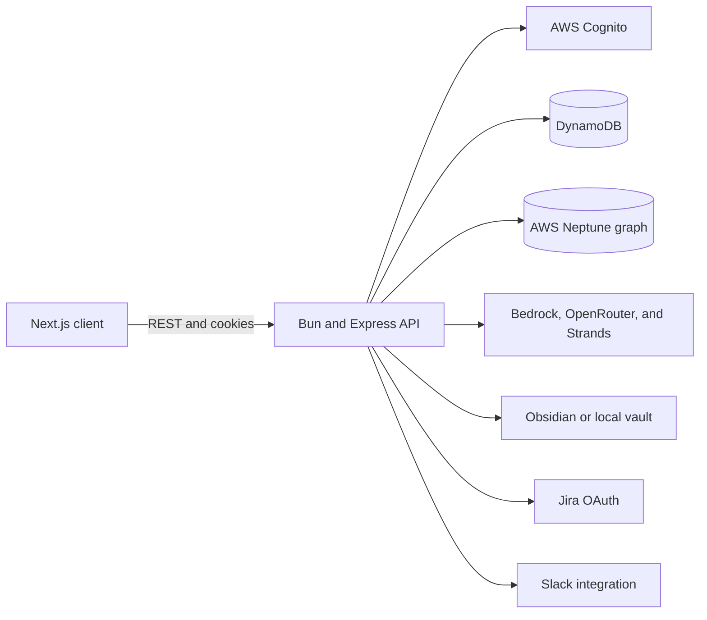

# Ops Ninja

Ops Ninja turns meeting records into durable operational context and reviewed, executable work. It
extracts decisions and action items from meeting transcripts, stores the resulting knowledge in
project-scoped records and a graph, and lets a human approve external actions before they reach Jira
or Slack.

The project also includes a context-aware chatbot. It uses a project's meeting history, decisions,
actions, and connected knowledge sources to answer questions with provenance instead of treating each
conversation as a blank slate.

## What It Does

- Ingests meeting transcripts and produces structured Minutes of Meeting (MOM) records.
- Tracks decisions, risks, participants, owners, due dates, and follow-up actions.
- Builds project-scoped graph relationships for cross-meeting context and provenance.
- Drafts Jira and Slack actions without dispatching them automatically.
- Requires human approval before an external action is executed.
- Provides project-scoped chat over meeting and operational records.
- Supports Cognito authentication and Jira OAuth integration.

## Architecture



The monorepo is managed with Turborepo and Bun workspaces:

```text
apps/
	client/       Next.js frontend
	server/       Bun, Express API, and agents
packages/
	db/           DynamoDB helpers
	graph-db/     Neptune helpers
	cache/        Shared cache package
	ui/           Shared UI package
	...           Shared TypeScript and ESLint configuration
```

## Requirements

- [Bun](https://bun.sh) 1.3.6 or newer
- Node.js 24 or newer
- AWS credentials with access to the configured services
- An AWS Cognito app client for authentication
- DynamoDB for application records
- AWS Neptune for graph features

AI providers and external integrations are configured by the server. They are optional for parts of
the UI, but required for transcript processing, graph-backed chat, or external action execution.

## Local Development

### 1. Install dependencies

From the repository root:

```bash
bun install
```

### 2. Configure the client

Copy the example file and set the API URL and Cognito login URL:

```bash
cp apps/client/.env.example apps/client/.env.local
```

The important client values are:

```dotenv
NEXT_PUBLIC_API_BASE_URL=http://localhost:8000
NEXT_PUBLIC_COGNITO_LOGIN_URL=https://your-cognito-domain.auth.us-east-1.amazoncognito.com/oauth2/authorize?client_id=YOUR_CLIENT_ID&response_type=code&scope=email+openid+phone+profile&redirect_uri=http://localhost:8000/api/v1/auth/cognito/callback
```

### 3. Configure the server

For local development, copy the server example file:

```bash
cp apps/server/.env.example apps/server/.env
```

At minimum, configure the server port, frontend origin, JWT secret, Cognito values, and AWS access.
The example file contains the complete development configuration and the production Secrets Manager
option.

Never commit `.env`, `.env.local`, cloud credentials, OAuth client secrets, or JWT secrets.

### 4. Start the workspace

Run the frontend and API together from the repository root:

```bash
bun run dev
```

Default local URLs:

- Frontend: `http://localhost:3000`
- API: `http://localhost:8000`
- API health check: `http://localhost:8000/health`

To run an app independently:

```bash
cd apps/client && bun run dev
cd apps/server && bun run dev
```

## Useful Commands

```bash
bun run build        # Build all configured packages and applications
bun run lint         # Run the Turborepo lint task
bun run check-types  # Run workspace type checks
bun run format       # Format TypeScript, TSX, and Markdown files
```

Client-specific commands:

```bash
cd apps/client
bun run lint
bun run build
bun run start
```

The server can also be started directly with `bun run index.ts` from `apps/server`.

## API Surface

The API is mounted under `/api/v1`:

| Area           | Routes                                             |
| -------------- | -------------------------------------------------- |
| Authentication | `/auth/cognito`, `/auth/jira`, callbacks, logout   |
| Projects       | `/projects` and `/project`                         |
| Users          | `/users`                                           |
| Integrations   | `/integrations`                                    |
| Meetings       | `/projects/:projectId/meetings`                    |
| Actions        | `/projects/:projectId/meetings/:meetingId/actions` |
| Chat           | `/projects/:projectId/chats`                       |
| Messages       | `/projects/:projectId/chats/:chatId/messages`      |

Authenticated requests use the session cookie established by the Cognito callback. CORS is configured
with the comma-separated `FRONTEND_URL` server setting.

## Operational Workflow

1. A user creates or selects a project.
2. A transcript is uploaded and processed into a structured MOM.
3. Decisions, participants, risks, and action items are persisted.
4. Project relationships are written to the graph and supporting knowledge stores.
5. The chatbot retrieves project-scoped context to answer questions.
6. The orchestrator drafts Jira or Slack actions.
7. A user reviews and approves the exact payload before dispatch.

## Security Notes

- Keep credentials in environment variables or AWS Secrets Manager.
- Use a strong, random `JWT_SECRET` of at least 32 characters in development and production.
- Restrict `FRONTEND_URL` to trusted origins.
- Do not bypass the human approval step for external actions without a deliberate product and security review.
- Treat transcript, MOM, graph, and integration data as sensitive operational information.

## Further Documentation

- [Client setup](apps/client/README.md)
- [Server configuration](apps/server/README.md)
- [GraphRAG implementation](apps/server/GRAPH_RAG_IMPLEMENTATION.md)
- [Frontend integration plan](apps/client/FRONTEND_INTEGRATION_PLAN.md)
- [Repository AI fixes summary](AI_AGENT_FIXES_SUMMARY.md)
